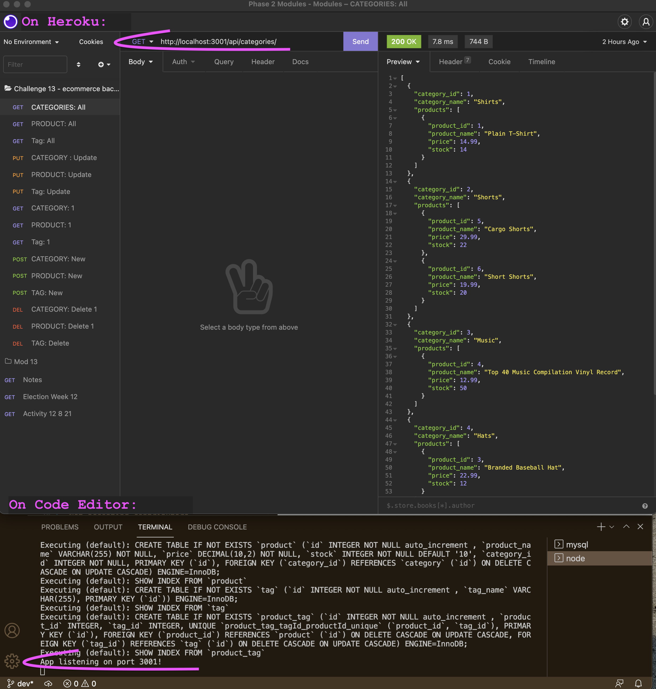

# **
cCommerce Back End
**

**
FEATURES
**

                   

&nbsp;

## **Project Description**

---

Back end code for a sample eCommerce website using Express, node & Sequelize.

&nbsp;

## Table of Contents

---

- [Installation](#installation)
- [Usage](#usage)
- [URL](#url)
- [Screenshot](#screenshot)
- [Contributing](#contributing)
- [Tests](#tests)
- [Resources](#resources)
- [Questions](#questions)
- [License](#license)

&nbsp;

## **Installation**

---

See package.json for dependencies and other details.

Code to local directory: `git clone` 

From command line npm install the following: `npm install` 

- Node (if not already on your system)
- Dotenv
- Express
- MySql/MySql2
- Sequelize
  &nbsp;

`mysql -u <username> -p` 
If need to re-seed the database ~ 
From the command-line, run the above mysql command to start mysql. Follow prompts 
Database is ecommerce_db 

In mySql command-line shell -
`source db/schema.sql`
`exit` or `quit` 
Then from code editor -
Confirm sequelize.sync force is set to true in server.js & seeds/index.js.  
Run `node seeds/index.js` to seed 

Immediately change force to false in both files
Run `node server` to start

&nbsp;

## **Usage**

---

This program will allow users to create, view, update and delete Products, Categories and Tags. 
Since this is the back end, it is not deployed. Use Heroku to see sample functionality by entering the various paths (see Heroku walkthrough video.) Stop the server with command-line shortcuts.

&nbsp;

## **URL**

---

Does not have a deployment URL.
[eCommerce run through on YouTube](https://youtu.be/ZxoK9hW8Xb4)

&nbsp;

## **Screenshot**

---

&nbsp;

### **Contributing**

---

Not accepting contributors.

&nbsp;

### **Tests**

---

No tests at this time.
&nbsp;

### **Resources**

---

#### I Used or Was Inspired By

https://levelup.gitconnected.com/table-relationships-in-sequelize-2e2533580c2a

https://newbedev.com/how-does-sequelize-sync-work-specifically-the-force-option

https://sequelize.org/master/manual/advanced-many-to-many.html

https://sequelize.org/master/manual/model-querying-basics.html

https://stackoverflow.com/questions/20460270/how-to-make-join-queries-using-sequelize-on-node-js
&nbsp;

### **Questions**

---

✉️ Reach me directly at melliedeedevelops@outlook.com    
Or checkout out my GitHub profile: [github.com/MellieDee](https://github.com/MellieDee)

&nbsp;

### **License**

---

Copyright (c) Melanie Dubberley.

Licensed under the [MIT](https://choosealicense.com/licenses) license.

&nbsp;

##### Return to:

---

- [Installation](#installation)
- [Usage](#usage)
- [URL](#url)
- [Screenshot](#screenshot)
- [Contributing](#contributing)
- [Tests](#tests)
- [Resources](#resources)
- [Questions](#questions)
- [License](#license)

&nbsp;
